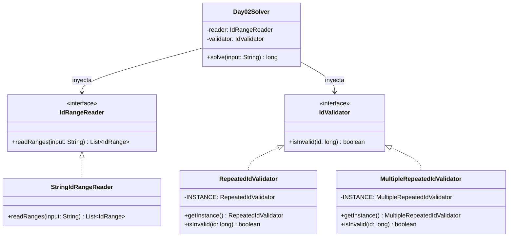

# Día 2: Gift Shop 

## Descripción del Problema

El objetivo de este reto consiste en depurar la base de datos de la tienda de regalos del Polo Norte, identificando y sumando aquellos IDs de productos inválidos agregados accidentalmente por uno de los Elfos.

*   **Parte A**: Un ID de producto es inválido si y solo si su número de dígitos es par y está compuesto exactamente por una misma mitad repetida dos veces (por ejemplo, `55`, `6464`, `123123`).
*   **Parte B**: La regla se flexibiliza. Ahora, un ID es inválido si está compuesto únicamente por una secuencia de dígitos repetida al menos dos veces (es decir, $k \ge 2$ repeticiones). Ejemplos: `12341234` ($k=2$), `123123123` ($k=3$), `1212121212` ($k=5$), `1111111` ($k=7$).
*   Los números no tienen ceros a la izquierda (por ejemplo, `0101` no es una entrada válida y se descarta).

---

## Modelo de Dominio e Identificación de Tipos

Para estructurar la lógica de negocio y garantizar la máxima mantenibilidad de las reglas, hemos definido las siguientes abstracciones:

1.  **`IdRange` (Record)**: Representa el concepto inmutable de rango numérico (`start` y `end`), definidos por tipos numéricos de alta precisión (`long`) para precaver desbordamientos aritméticos causados por IDs de gran tamaño.
2.  **`IdRangeReader` (Interfaz/Adapter)**: Contrato para desacoplar el origen de datos físico del motor lógico de resolución.
3.  **`StringIdRangeReader` (Clase)**: Implementación concreta encargada de procesar la entrada de texto y extraer la colección de rangos numéricos.
4.  **`IdValidator` (Interfaz/Strategy)**: Contrato polimórfico limpio que modela las reglas de validación de IDs. Evita el acoplamiento rígido del solver a métodos estáticos de clases concretas.
5.  **`RepeatedIdValidator` (Singleton)**: Implementación de la validación para la Parte A (repetición única a la mitad).
6.  **`MultipleRepeatedIdValidator` (Singleton)**: Implementación de la validación para la Parte B (múltiples repeticiones arbitrarias de longitud divisor).
7.  **`Day02Solver` (Orquestador Base)**: Orquestador funcional puro que recibe el lector y el validador inyectados para resolver el problema iterando mediante Streams de Java de forma declarativa.
8.  **`Day02ASolver` / `Day02BSolver` (Orquestadores Específicos)**: Adaptadores que inyectan los singletons de validación requeridos en el motor orquestador general.

---

## Arquitectura del Día

La arquitectura implementa la Inversión de Dependencias (DIP) de forma rigurosa, permitiendo extender las reglas de validación (Parte B) sin modificar la lógica interna del motor del Solver.

---

## Patrones de Diseño Aplicados

*   **Strategy Pattern (Validadores)**: Encapsulamos las familias de algoritmos de validación tras la abstracción `IdValidator`. El `Day02Solver` opera con total agnosticismo sobre los detalles de implementación específicos de las reglas de negocio.
*   **Adapter Pattern (Reader)**: Centralizamos el parseo de comas y guiones de la entrada física en `StringIdRangeReader`, aislando la lógica de negocio del formato físico del archivo de recursos.
*   **Singleton Pattern**: Implementamos `RepeatedIdValidator` y `MultipleRepeatedIdValidator` con constructores privados para restringir la creación de instancias.

---

## Principios de Diseño Aplicados

Durante la implementación de este día se han respetado rigurosamente los siguientes principios de diseño:

*   **Principio de Inversión de Dependencias (DIP)**: El orquestador `Day02Solver` no depende de la lectura de ficheros crudos ni de algoritmos de validación estáticos. Depende enteramente de las abstracciones `IdRangeReader` e `IdValidator`, permitiendo su extensión sin alterar su código base.
*   **Principio Abierto/Cerrado (OCP)**: Gracias a la abstracción de `IdValidator`, el sistema está abierto a añadir nuevas reglas de validación (como se hizo en la Parte B con `MultipleRepeatedIdValidator`) pero cerrado a modificaciones en la estructura central.
*   **Principio de Responsabilidad Única (SRP)**: Las responsabilidades están perfectamente divididas. `StringIdRangeReader` tiene el único propósito de interpretar la cadena de texto y construir el modelo de dominio `IdRange`. Las clases validadoras solo se encargan de determinar la validez matemática, y el `Day02Solver` orquesta el flujo sin conocer detalles implementativos.

---

