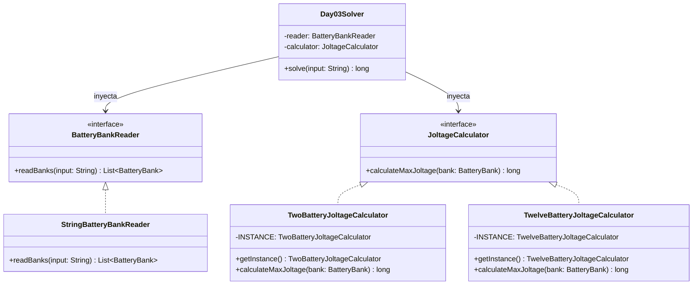

# Día 3: Lobby

## Descripción del Problema

El objetivo de este reto consiste en reactivar las escaleras mecánicas del vestíbulo (Lobby) utilizando bancos de baterías de emergencia. Cada banco de baterías viene definido por una secuencia de dígitos (del 1 al 9) que representan los niveles de voltaje (joltage) de sus baterías individuales.

*   **Parte A**: Para cada banco de baterías, debemos encontrar el valor de voltaje de salida máximo que se puede generar seleccionando dos baterías distintas, $d_i$ y $d_j$, tales que la batería $d_i$ aparezca antes que la batería $d_j$ en la secuencia física (es decir, $i < j$). La tensión combinada resultante se define como:

    $$V = 10 \cdot d_i + d_j$$
    
    Debemos sumar los voltajes máximos de todos los bancos de baterías de la entrada del puzzle.

*   **Parte B**: La escalera mecánica requiere mayor potencia. Ahora debemos encender exactamente **doce** baterías dentro de cada banco de forma que el valor de la tensión resultante de 12 dígitos sea el máximo posible. Debemos conservar el orden relativo original de los dígitos elegidos.

---

## Modelo de Dominio e Identificación de Tipos

1.  **`BatteryBank` (Record)**: Representa el concepto inmutable de un banco de baterías, encapsulando la secuencia de caracteres numéricos de los ratings.
2.  **`BatteryBankReader` (Interfaz/Adapter)**: Contrato para desacoplar el origen físico de los datos (por ejemplo, un archivo o string) del resolvedor principal.
3.  **`StringBatteryBankReader` (Clase)**: Implementación concreta de la lectura y procesamiento de cadenas de texto separadas por espacios o saltos de línea.
4.  **`JoltageCalculator` (Interfaz/Strategy)**: Abstracción polimórfica que define la interfaz para calcular el voltaje máximo de un banco de baterías.
5.  **`TwoBatteryJoltageCalculator` (Singleton)**: Implementación del algoritmo de cálculo de voltaje máximo para dos baterías.
6.  **`TwelveBatteryJoltageCalculator` (Singleton)**: Implementación del algoritmo de cálculo de voltaje máximo para exactamente doce baterías, empleando una estrategia ávida (Greedy).
7.  **`Day03Solver` (Orquestador Base)**: Motor de ejecución inyectable que procesa la colección de bancos usando operaciones de Java Streams para calcular el acumulado final de joltage.
8.  **`Day03ASolver` / `Day03BSolver` (Orquestadores Específicos)**: Adaptadores que inyectan los singletons de cálculo correspondientes en el motor orquestador general.

---

## Arquitectura del Día

El motor resolvedor (`Day03Solver`) se desacopla completamente del formato de entrada y del algoritmo de cálculo de voltaje gracias a la aplicación de inyección de dependencias.

---

## Patrones de Diseño Aplicados

*   **Strategy Pattern (Calculadora)**: Permite alternar limpiamente entre las estrategias `TwoBatteryJoltageCalculator` (Parte A) y `TwelveBatteryJoltageCalculator` (Parte B) inyectándolas en el motor del orquestador `Day03Solver`.
*   **Adapter Pattern (Reader)**: Aísla la carga física del formato textual, garantizando que el resto del sistema interactúe directamente con objetos de dominio fuertemente tipados (`BatteryBank`).
*   **Singleton Pattern**: Implementa las calculadoras como componentes libres de estado de acceso único, optimizando el consumo de memoria.

---

## Principios de Diseño Aplicados

Durante la implementación de este día se han respetado rigurosamente los siguientes principios de diseño:

*   **Principio Abierto/Cerrado (OCP)**: A través del patrón Strategy (`JoltageCalculator`), la arquitectura se ha mantenido abierta a la extensión de algoritmos (añadiendo de forma indolora la calculadora Greedy de 12 baterías para la Parte B) manteniéndose absolutamente cerrada a modificaciones de la clase orquestadora.
*   **Principio de Inversión de Dependencias (DIP)**: El componente principal `Day03Solver` ignora por completo las implementaciones algorítmicas o la naturaleza física del input. Solo depende de interfaces abstractas (`BatteryBankReader` y `JoltageCalculator`), logrando un desacoplamiento perfecto.
*   **Principio de Responsabilidad Única (SRP)**: Cada módulo resuelve un único problema de dominio. `StringBatteryBankReader` asume exclusivamente las tareas de I/O, los `JoltageCalculator` encierran toda la matemática y complejidad algorítmica de la pila monótona, y el orquestador se limita al flujo de control y recuento final.

---
