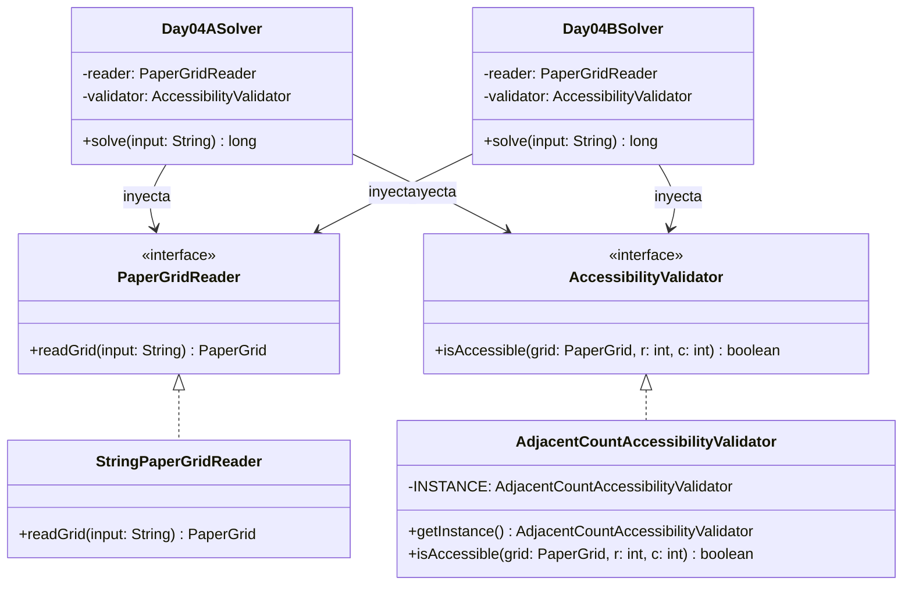

# Día 4: Printing Department

## Descripción del Problema

El objetivo de este reto consiste en optimizar el movimiento de los montacargas (forklifts) que transportan grandes rollos de papel en el departamento de impresión (Printing Department) del Polo Norte.

Los rollos de papel se disponen sobre una cuadrícula bidimensional de caracteres, representada por `@` (rollo de papel) y `.` (espacio vacío).

*   **Parte A**: Un montacargas solo puede acceder a un rollo de papel si este se encuentra en una posición despejada, lo cual se define como tener **menos de cuatro** rollos de papel adyacentes en las ocho posiciones vecinas (horizontal, vertical y diagonal). Debemos calcular el número total de rollos de papel que son accesibles para los montacargas en la cuadrícula inicial.
*   **Parte B**: Una vez que un rollo de papel es accesible por el montacargas, se retira de la cuadrícula. Al retirarse, la configuración de adyacencias de los rollos restantes cambia, lo que puede hacer que otros rollos que antes eran inaccesibles ahora sí lo sean. Este proceso de eliminación simultánea se repite iterativamente por rondas hasta que no se puedan retirar más rollos. Debemos calcular el número total acumulado de rollos retirados.

---

## Modelo de Dominio e Identificación de Tipos

1.  **`PaperGrid` (Clase de Dominio)**: Representa el estado interno y la lógica pura de la cuadrícula de rollos de papel. Proporciona métodos para verificar si una celda contiene un rollo, contar los vecinos adyacentes de tipo papel, y mutar el estado de la cuadrícula de forma controlada (`removePaper`).
2.  **`Coordinate` (Record de Dominio)**: Representación inmutable de una posición $(row, col)$ en la cuadrícula.
3.  **`PaperGridReader` (Interfaz/Adapter)**: Contrato para desacoplar el origen físico de la entrada (por ejemplo, archivos de recursos o cadenas de texto) del resolvedor.
4.  **`StringPaperGridReader` (Clase)**: Implementación concreta encargada de parsear un string multilínea en una representación `PaperGrid`.
5.  **`AccessibilityValidator` (Interfaz/Strategy)**: Estrategia polimórfica para encapsular las reglas de accesibilidad de los rollos de papel.
6.  **`AdjacentCountAccessibilityValidator` (Singleton)**: Implementación de la estrategia de la regla de adyacencia (menos de 4 rollos adyacentes).
7.  **`Day04ASolver` (Orquestador Parte A)**: Adaptador `SafeSolver` para calcular la cantidad inicial de rollos accesibles.
8.  **`Day04BSolver` (Orquestador Parte B)**: Adaptador `SafeSolver` que implementa la simulación iterativa de eliminación por rondas utilizando pipelines funcionales y la estrategia de accesibilidad inyectada.

---

## Arquitectura del Día

El diseño utiliza inyección de dependencias y el patrón Strategy para mantener la lógica de validación separada de la representación de la cuadrícula.

---

## Patrones de Diseño Aplicados

*   **Strategy Pattern (Validación de accesibilidad)**: Aísla las reglas de negocio (como el límite de vecinos) en clases intercambiables que implementan `AccessibilityValidator`.
*   **Adapter Pattern (Reader)**: Desacopla la lógica de negocio de la entrada física, delegando el parseo de los saltos de línea de la cuadrícula a `StringPaperGridReader`.
*   **Singleton Pattern**: Garantiza una única instancia en memoria para `AdjacentCountAccessibilityValidator`, ya que no almacena estado interno variable.

---

## Principios de Diseño Aplicados

Durante la implementación de este día se han respetado rigurosamente los siguientes principios de diseño:

*   **Principio de Responsabilidad Única (SRP)**: La estructura de datos de la cuadrícula de papel (`PaperGrid`) maneja exclusivamente la disposición geométrica, mientras que las reglas matemáticas de accesibilidad recaen exclusivamente sobre `AccessibilityValidator`. La carga de archivos e I/O queda relegada a `StringPaperGridReader`.
*   **Principio de Inversión de Dependencias (DIP)**: Los resolvedores `Day04ASolver` y `Day04BSolver` dependen puramente de la interfaz `AccessibilityValidator` para dictaminar si un rollo puede o no retirarse. Al invertir esta dependencia, logramos abstraernos de la regla específica ("menos de 4 vecinos").
*   **Principio Abierto/Cerrado (OCP)**: Si el departamento de impresión altera en el futuro la restricción de seguridad de adyacencias o los tipos de movimiento del montacargas, el sistema permite crear y utilizar un nuevo validador extendiendo `AccessibilityValidator` sin modificar en absoluto `PaperGrid` ni a los orquestadores principales.

---
