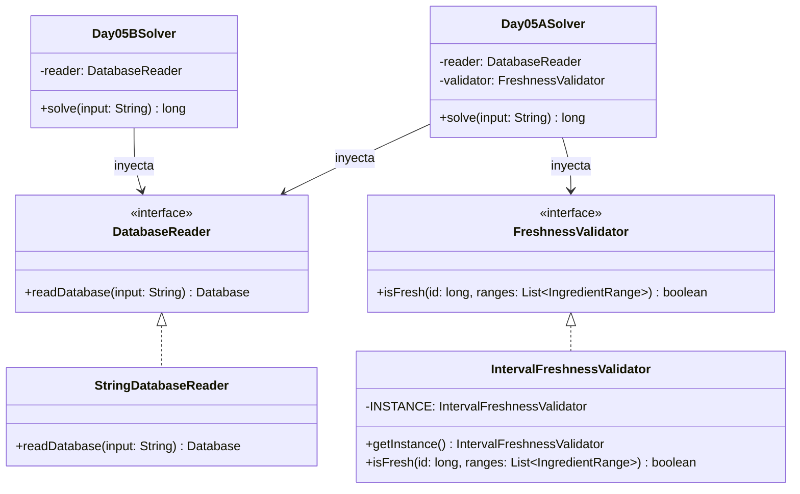

# Día 5: Cafeteria

## Descripción del Problema

El objetivo de este reto consiste en ayudar a los Elfos en la cocina a identificar qué ingredientes de su despensa están frescos y cuáles se han echado a perder debido a un cambio apresurado en el sistema de gestión de inventario.

El archivo de la base de datos consta de dos secciones separadas por una línea en blanco:
1. Una lista de rangos de IDs de ingredientes frescos (por ejemplo, `3-5` indica que los IDs 3, 4 y 5 son frescos). Los rangos son inclusivos y pueden solaparse.
2. Una lista de IDs de ingredientes que están disponibles actualmente en la cocina.

*   **Parte A**: Determinar cuántos de los ingredientes disponibles actualmente en la despensa son frescos (es decir, su ID cae dentro de al menos uno de los rangos especificados).
*   **Parte B**: Ignorar la lista de IDs de ingredientes disponibles y calcular la cantidad total de IDs únicos que se consideran frescos según todos los rangos (es decir, la unión de todos los intervalos, resolviendo solapamientos).

---

## Modelo de Dominio e Identificación de Tipos

1.  **`IngredientRange` (Record)**: Representa el concepto inmutable de un intervalo `[start, end]`. Implementa `Comparable` para permitir ordenar los rangos por su extremo inferior de forma nativa.
2.  **`Database` (Record)**: Agrupa el listado de rangos de frescura y los IDs de los ingredientes disponibles.
3.  **`DatabaseReader` (Interfaz/Adapter)**: Contrato para desacoplar el origen de datos (I/O física) de la lógica de procesamiento.
4.  **`StringDatabaseReader` (Clase)**: Implementación concreta encargada de parsear los bloques de texto separados por doble línea.
5.  **`FreshnessValidator` (Interfaz/Strategy)**: Estrategia de negocio para validar si un ID de ingrediente dado es fresco.
6.  **`IntervalFreshnessValidator` (Singleton)**: Implementación de la estrategia que comprueba si un ID pertenece a alguno de los intervalos frescos.
7.  **`Day05ASolver` (Orquestador Parte A)**: Adaptador `SafeSolver` que filtra la lista de IDs de ingredientes disponibles utilizando la estrategia inyectada.
8.  **`Day05BSolver` (Orquestador Parte B)**: Adaptador `SafeSolver` que implementa el algoritmo de mezcla de intervalos en $O(R \log R)$ para calcular el tamaño total de la unión de intervalos frescos.

---

## Arquitectura del Día

El motor de resolución se desacopla por completo a través de la inyección de dependencias.

---

## Patrones de Diseño Aplicados

*   **Strategy Pattern (Validación de frescura)**: Encapsula la lógica que determina si un ID es fresco detrás de `FreshnessValidator`, permitiendo alterar las reglas de negocio sin modificar el resolvedor.
*   **Adapter Pattern (Reader)**: Aísla la lectura de los dos bloques de entrada mediante `StringDatabaseReader`, entregando un objeto de dominio tipado `Database`.
*   **Singleton Pattern**: Implementa `IntervalFreshnessValidator` de forma libre de estado con un punto único de acceso global.

---

## Principios de Diseño Aplicados

Durante la implementación de este día se han respetado rigurosamente los siguientes principios de diseño:

*   **Principio de Inversión de Dependencias (DIP)**: La lógica de resolución superior en `Day05ASolver` interactúa exclusivamente con los contratos abstractos `DatabaseReader` y `FreshnessValidator`. Las implementaciones concretas de bajo nivel son inyectadas sin contaminar el orquestador principal.
*   **Principio Abierto/Cerrado (OCP)**: Las reglas matemáticas para determinar la frescura de un ingrediente pueden evolucionar fácilmente o ramificarse creando nuevas implementaciones de `FreshnessValidator` sin necesidad de alterar la lógica central de la aplicación.
*   **Principio de Responsabilidad Única (SRP)**: El sistema distribuye funciones en componentes altamente cohesivos. El modelo de dominio (`Database` e `IngredientRange`) encapsula los datos brutos; el Adapter (`StringDatabaseReader`) maneja exclusivamente la complejidad de la I/O de texto; y las Estrategias asumen la matemática de los intervalos.

---
