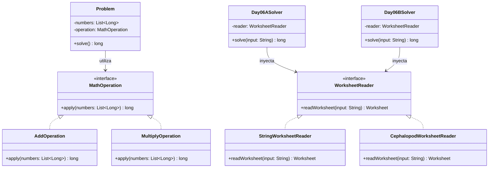

# Día 6: Trash Compactor

## Descripción del Problema

El objetivo de este reto consiste en ayudar al cefalópodo más joven a resolver sus deberes de matemáticas mientras esperamos a que abran la puerta del triturador de basura magnéticamente sellada.

La hoja de problemas se presenta como una lista horizontal larga alineada verticalmente.
* Cada problema consta de un grupo de números colocados verticalmente.
* Al final de cada problema se encuentra el operador aritmético (`+` para sumar o `*` para multiplicar) que se debe aplicar a los números.
* Los problemas individuales están separados horizontalmente por al menos una columna compuesta enteramente de espacios.

*   **Parte A**: Calcular el gran total sumando las respuestas individuales de todos los problemas de la hoja de trabajo (leídos horizontalmente).
*   **Parte B**: Los cefalópodos leen al revés y en vertical. Cada número se lee en vertical (de arriba a abajo en su propia columna) y los números dentro de cada bloque de problema se leen de derecha a izquierda (una columna a la vez). Calcular el gran total con esta nueva interpretación.

---

## Modelo de Dominio e Identificación de Tipos

1.  **`ColumnRange` (Record)**: Representa el rango horizontal contiguo `[startCol, endCol]` que ocupa un bloque de problema en la hoja de trabajo.
2.  **`MathOperation` (Interfaz Strategy)**: Estrategia que define la operación matemática a realizar sobre una lista de números.
3.  **`AddOperation` / `MultiplyOperation` (Clases)**: Estrategias concretas para sumar (`+`) y multiplicar (`*`).
4.  **`Problem` (Record)**: Representa un problema individual con su lista de números y la estrategia de operación asociada.
5.  **`Worksheet` (Record)**: Agrupa el listado completo de problemas.
6.  **`WorksheetReader` (Interfaz Adapter)**: Contrato para desacoplar la fuente física (bloque de texto) del procesamiento de lógica de negocio.
7.  **`StringWorksheetReader` (Clase)**: Lector para la Parte A que extrae números leyendo horizontalmente de cada fila.
8.  **`CephalopodWorksheetReader` (Clase)**: Lector para la Parte B que extrae números leyendo verticalmente de arriba a abajo y de derecha a izquierda por columnas.
9.  **`Day06ASolver` (Orquestador Parte A)**: Adaptador `SafeSolver` que inicializa `StringWorksheetReader`.
10. **`Day06BSolver` (Orquestador Parte B)**: Adaptador `SafeSolver` que inicializa `CephalopodWorksheetReader`.

---

## Arquitectura del Día

---

## Patrones de Diseño Aplicados

*   **Strategy Pattern (Operaciones Matemáticas)**: La interfaz `MathOperation` y sus implementaciones permiten delegar dinámicamente cómo calcular el resultado de un problema dependiendo del operador encontrado (`+` o `*`). Esto facilita enormemente la adición de nuevos operadores en el futuro (abierto a extensión, cerrado a modificación).
*   **Adapter Pattern (Reader)**: Desacopla por completo el formato de entrada de texto mediante la interfaz `WorksheetReader`, permitiendo que el resolvedor solo interactúe con el modelo de dominio `Worksheet`.

---

## Principios de Diseño Aplicados

Durante la implementación de este día se han respetado rigurosamente los siguientes principios de diseño:

*   **Principio de Inversión de Dependencias (DIP)**: Los orquestadores (`Day06ASolver`, `Day06BSolver`) no interactúan con el texto directamente ni se acoplan a un algoritmo de lectura 2D específico. Dependen enteramente de las interfaces `WorksheetReader` y `MathOperation`, protegiendo el flujo central del programa de los cambios en formato.
*   **Principio Abierto/Cerrado (OCP)**: El diseño permite incorporar nuevos operadores aritméticos en el futuro (como divisiones o restas) instanciando de forma directa nuevas clases que implementen `MathOperation`, sin necesidad de alterar el record `Problem` ni los solvers.
*   **Principio de Responsabilidad Única (SRP)**: Existe una división estricta de dominios de cómputo. Las clases que implementan `WorksheetReader` asumen la carga del complejo parseo espacial de caracteres (lectura matricial horizontal vs vertical); las implementaciones de `MathOperation` asumen el álgebra, y `Problem` simplemente retiene su estado inmutable.

---
