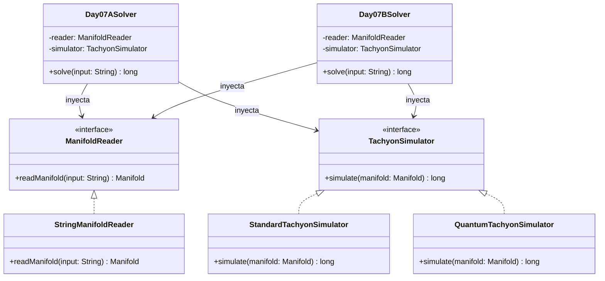

# Día 7: Laboratories 

## Descripción del Problema

El objetivo de este reto consiste en calcular cuántas veces se divide (split) un rayo taquiónico que entra en un colector (manifold) de taquiones mientras intentamos reparar el teletransportador que tiene un error de código 0H-N0.

El diagrama del colector se representa por una cuadrícula de caracteres:
* El rayo inicial entra en la posición marcada con la letra `S` en la fila superior (fila 0) y viaja hacia abajo.
* El rayo viaja libremente a través del espacio vacío representado por `.`.
* Si un rayo se topa con un divisor `^`, el rayo se detiene en esa posición y se emiten dos nuevos rayos en la misma fila: uno a la izquierda inmediata y otro a la derecha inmediata.
* Los rayos siempre continúan su viaje hacia abajo en las filas siguientes.
* Si dos divisores diferentes emiten rayos hacia la misma columna, estos se fusionan (no se duplican).

*   **Parte A**: Determinar el número total de divisiones (splits) que ocurren a lo largo de todo el colector.
*   **Parte B**: Bajo la interpretación de muchos mundos cuántica, cada división de divisor `^` genera dos líneas temporales paralelas e independientes (una hacia la izquierda y otra hacia la derecha). Se debe calcular la cantidad total de líneas temporales activas después de que una partícula complete todos sus posibles caminos por el manifold.

---

## Modelo de Dominio e Identificación de Tipos

1.  **`Manifold` (Record)**: Representa la cuadrícula física del colector de taquiones de ancho y alto fijos.
2.  **`ManifoldReader` (Interfaz Adapter)**: Contrato para desacoplar el origen del archivo físico del procesamiento de la lógica.
3.  **`StringManifoldReader` (Clase)**: Implementación concreta que lee y construye un objeto de dominio `Manifold` a partir de un string de entrada.
4.  **`TachyonSimulator` (Interfaz Strategy)**: Estrategia de negocio para simular la propagación de rayos en el manifold.
5.  **`StandardTachyonSimulator` (Clase)**: Implementación de la estrategia de la Parte A para contar el total de splits en tiempo lineal.
6.  **`QuantumTachyonSimulator` (Clase)**: Implementación de la estrategia de la Parte B para calcular líneas temporales mediante programación dinámica.
7.  **`Day07ASolver` (Orquestador Parte A)**: Adaptador `SafeSolver` que inyecta `StandardTachyonSimulator`.
8.  **`Day07BSolver` (Orquestador Parte B)**: Adaptador `SafeSolver` que inyecta `QuantumTachyonSimulator`.

---

## Arquitectura del Día

---

## Patrones de Diseño Aplicados

*   **Strategy Pattern (Simulación Taquiónica)**: Abstrae la simulación y el conteo de divisiones a través de `TachyonSimulator`. Si en el futuro cambian las reglas físicas del colector, podemos introducir un nuevo simulador sin alterar el resolvedor ni las clases del dominio.
*   **Adapter Pattern (Reader)**: Aísla y desacopla la conversión del archivo de texto en bruto al modelo de dominio `Manifold`.

---

## Principios de Diseño Aplicados

Durante la implementación de este día se han respetado rigurosamente los siguientes principios de diseño:

*   **Principio de Inversión de Dependencias (DIP)**: Los orquestadores `Day07ASolver` y `Day07BSolver` no dependen de la simulación cuántica o lineal subyacente, ni del formato de entrada. Ambos operan en alto nivel inyectando las abstracciones `ManifoldReader` y `TachyonSimulator`.
*   **Principio Abierto/Cerrado (OCP)**: A través del polimorfismo (`TachyonSimulator`), el diseño es completamente abierto a ser extendido con nuevos modelos de propagación o nuevas fórmulas de mecánica cuántica (simuladores), manteniéndose cerrado a la modificación de `Manifold` o de los orquestadores.
*   **Principio de Responsabilidad Única (SRP)**: El sistema está claramente parcelado en responsabilidades únicas: `StringManifoldReader` parsea el texto, `Manifold` mantiene inmutable la geometría de la cuadrícula, y las estrategias `TachyonSimulator` ejecutan la simulación computacional (recorrido topológico o programación dinámica).

---
