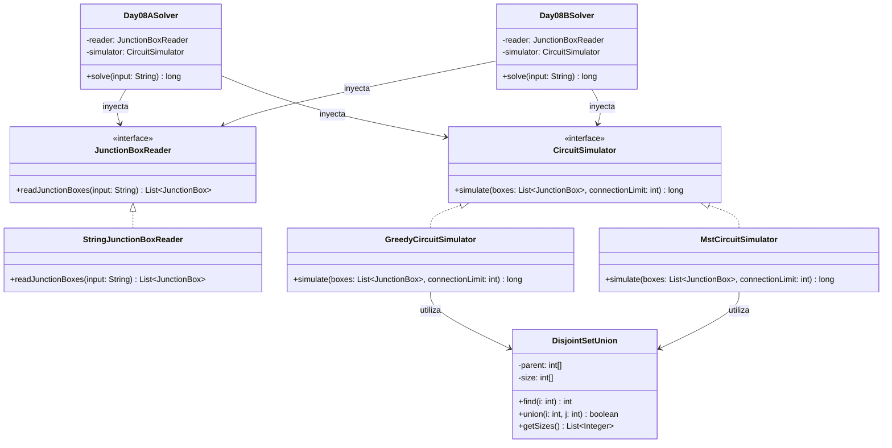

# Día 8: Playground

## Descripción del Problema

El objetivo de este reto consiste en ayudar a los Elfos a conectar cajas de conexiones eléctricas (junction boxes) suspendidas en un espacio tridimensional utilizando tiras de luces para formar circuitos eléctricos.

* Cada caja de conexiones se describe mediante coordenadas 3D $(x, y, z)$.
* Los Elfos desean conectar progresivamente las parejas de cajas que se encuentren a la menor distancia en línea recta (distancia Euclídea).
* Al conectar dos cajas de conexiones, se fusionan sus circuitos. Si las cajas ya pertenecían al mismo circuito, no ocurre ningún cambio.

*   **Parte A**: Realizar las 1000 conexiones más cortas entre todas las parejas de cajas de conexiones del colector. Multiplicar los tamaños de los tres circuitos independientes más grandes resultantes.
*   **Parte B**: Continuar conectando las parejas más cortas que no estén ya conectadas hasta que todas las cajas formen un único circuito gigante. Multiplicar las coordenadas $X$ de las dos cajas asociadas al último enlace necesario para conectar la red.

---

## Modelo de Dominio e Identificación de Tipos

1.  **`JunctionBox` (Record)**: Representa un punto inmutable en el espacio tridimensional $(x, y, z)$. Expone un método para calcular la distancia cuadrática a otra caja.
2.  **`JunctionBoxPair` (Record)**: Representa una pareja de cajas y su distancia cuadrática. Implementa `Comparable` para ordenar de forma determinista y estable.
3.  **`DisjointSetUnion` (Clase)**: Estructura de Conjuntos Disjuntos (Union-Find) que gestiona y fusiona dinámicamente los componentes conexos (circuitos) en tiempo casi constante.
4.  **`JunctionBoxReader` (Interfaz Adapter)**: Contrato para desacoplar la lectura de la entrada física del procesamiento lógico.
5.  **`StringJunctionBoxReader` (Clase)**: Implementación concreta que parsea las líneas de coordenadas CSV.
6.  **`CircuitSimulator` (Interfaz Strategy)**: Estrategia de negocio para simular la conexión de las cajas de conexiones.
7.  **`GreedyCircuitSimulator` (Clase)**: Implementación para la Parte A que simula las primeras 1000 conexiones y multiplica los tres circuitos más grandes.
8.  **`MstCircuitSimulator` (Clase)**: Implementación para la Parte B que simula la red hasta formar un único árbol de expansión mínimo (MST) y multiplica las coordenadas X del último enlace.
9.  **`Day08ASolver` (Orquestador Parte A)**: Adaptador `SafeSolver` que inyecta `GreedyCircuitSimulator`.
10. **`Day08BSolver` (Orquestador Parte B)**: Adaptador `SafeSolver` que inyecta `MstCircuitSimulator`.

---

## Arquitectura del Día

---

## Patrones de Diseño Aplicados

*   **Strategy Pattern (Simulación de Conexión)**: Abstrae la simulación e integración de circuitos a través de `CircuitSimulator`. Esto permite intercambiar la estrategia greedy por otros simuladores en el futuro (abierto a extensión, cerrado a modificación).
*   **Adapter Pattern (Reader)**: Desacopla la lectura del origen de datos a través de `JunctionBoxReader`, entregando una lista tipada del modelo de dominio `JunctionBox`.

---

## Principios de Diseño Aplicados

Durante la implementación de este día se han respetado rigurosamente los siguientes principios de diseño:

*   **Principio de Inversión de Dependencias (DIP)**: La capa de orquestación (`Day08ASolver` y `Day08BSolver`) no tiene conocimiento de los cálculos geométricos espaciales ni de las estructuras de árboles de expansión mínima (MST). Depende única y exclusivamente de la abstracción genérica `CircuitSimulator`.
*   **Principio Abierto/Cerrado (OCP)**: Mediante el uso del polimorfismo, la arquitectura está preparada para incorporar nuevas simulaciones de cableado o estrategias de conexión eléctrica en el futuro sin la necesidad de modificar el código existente en el núcleo orquestador.
*   **Principio de Responsabilidad Única (SRP)**: El modelo establece fronteras funcionales formidables: `DisjointSetUnion` se enfoca únicamente en la teoría de grafos pura y fusiones disjuntas; `JunctionBox` es un simple contenedor inmutable de la física 3D, y los simuladores asumen el algoritmo (basado en Kruskal).

---
