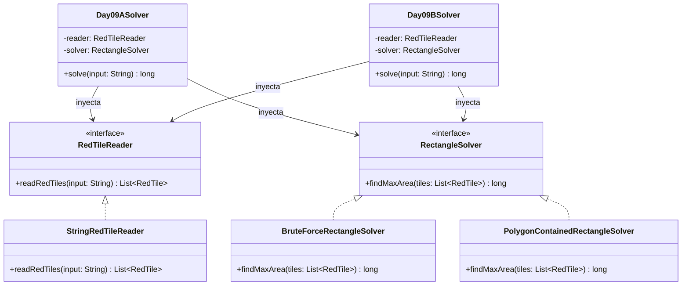

# Día 9: Movie Theater

## Descripción del Problema

El objetivo de este reto consiste en ayudar a los Elfos a redecorar la sala de cine del taller de Papá Noel. La sala tiene un suelo de baldosas y los Elfos han marcado la posición de ciertas baldosas rojas en una cuadrícula.

Queremos encontrar el rectángulo de mayor área posible que tenga dos baldosas rojas de la entrada como esquinas opuestas.
* Se nos proporciona una lista de coordenadas $(x, y)$ de las baldosas rojas.
* El área del rectángulo delimitado por dos baldosas opuestas $(x_1, y_1)$ y $(x_2, y_2)$ es:
  $$\text{Area} = (|x_1 - x_2| + 1) \cdot (|y_1 - y_2| + 1)$$

*   **Parte A**: Encontrar el área máxima de cualquier rectángulo posible que use dos baldosas rojas como esquinas opuestas.

---

## Modelo de Dominio e Identificación de Tipos

1.  **`RedTile` (Record)**: Representa una baldosa roja en el plano bidimensional $(x, y)$. Contiene la lógica para calcular el área del rectángulo delimitado entre ella y otra baldosa roja como esquinas opuestas.
2.  **`RedTileReader` (Interfaz Adapter)**: Contrato para desacoplar el origen físico de los datos (texto) del dominio.
3.  **`StringRedTileReader` (Clase)**: Implementación concreta que parsea las líneas de coordenadas de las baldosas rojas.
4.  **`RectangleSolver` (Interfaz Strategy)**: Estrategia de negocio para buscar y maximizar el rectángulo.
5.  **`BruteForceRectangleSolver` (Clase)**: Implementación de la estrategia de la Parte A que busca mediante un enfoque cuadrático $O(V^2)$ comparando todas las parejas de baldosas.
6.  **`PolygonContainedRectangleSolver` (Clase)**: Implementación de la estrategia de la Parte B, aplicando técnicas avanzadas de geometría computacional para asegurar restricciones sobre las baldosas interiores.
7.  **`Day09ASolver` / `Day09BSolver` (Orquestadores)**: Adaptadores que inyectan los lectores y estrategias de cálculo correspondientes para orquestar la resolución global de cada parte.

---

## Arquitectura del Día

---

## Patrones de Diseño Aplicados

*   **Strategy Pattern (Algoritmo de Maximización)**: Abstrae la lógica de búsqueda de rectángulos mediante la interfaz `RectangleSolver`. Si en la parte B se introducen restricciones adicionales o se requiere un algoritmo más rápido para un volumen mayor de datos, se puede crear una nueva estrategia sin alterar el resolvedor ni las baldosas.
*   **Adapter Pattern (Reader)**: Desacopla la lectura del origen de texto mediante `RedTileReader` entregando listas tipadas del dominio `RedTile`.

---

## Principios de Diseño Aplicados

Durante la implementación de este día se han respetado rigurosamente los siguientes principios de diseño:

*   **Principio de Inversión de Dependencias (DIP)**: La clase orquestadora (`Day09ASolver`) inyecta e interactúa exclusivamente con los contratos abstractos `RedTileReader` y `RectangleSolver`. Al no depender directamente de la implementación algorítmica por fuerza bruta, el código central permanece robusto y agnóstico.
*   **Principio Abierto/Cerrado (OCP)**: A través del polimorfismo que provee la interfaz `RectangleSolver`, el sistema de cómputo está abierto a la extensión algorítmica (p.ej. introduciendo técnicas de barrido geométrico o árboles espaciales si el conjunto de datos creciera), pero cerrado a la modificación de la clase de dominio `RedTile`.
*   **Principio de Responsabilidad Única (SRP)**: Las responsabilidades de cálculo están segmentadas milimétricamente: `RedTile` encapsula exclusivamente la fórmula matemática del área en 2D; el adaptador de lectura asume las irregularidades del parseo CSV del archivo; y la estrategia en `BruteForceRectangleSolver` lidera únicamente las combinatorias de pares de puntos.

---
