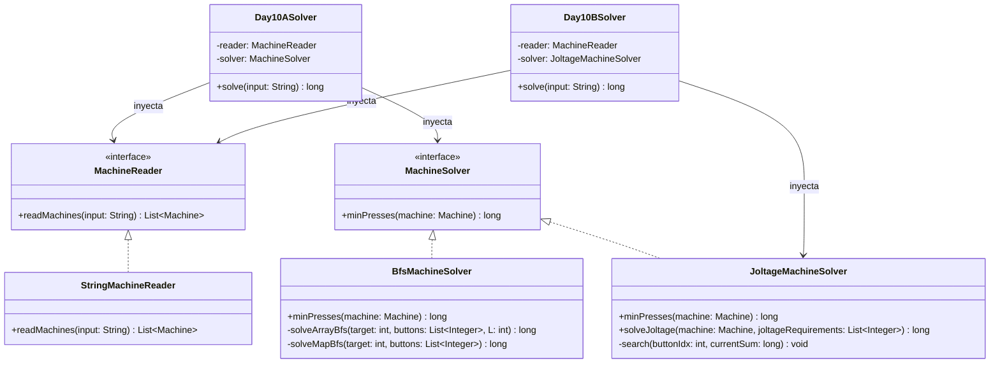

# Día 10: Factory 

## Descripción del Problema

El taller de Papá Noel tiene máquinas de fábrica que se encuentran fuera de servicio (offline). Necesitamos encontrar el procedimiento de inicialización para encenderlas.
Cada línea describe una máquina e incluye:
1. Un diagrama de luces indicadoras entre corchetes `[...]`, donde `.` representa apagado y `#` encendido. El número de luces comienza todo apagado.
2. Uno o más botones cableados entre paréntesis `(...)` que listan las luces (0-indexadas) que alternan su estado (on/off) al pulsarlo.
3. Requerimientos de voltaje entre llaves `{...}` que representan los voltajes objetivos para la Parte B.

Queremos encontrar el **mínimo número total de pulsaciones** de botones para configurar las máquinas.

*   **Parte A**: Encontrar la suma de las pulsaciones mínimas necesarias para configurar todas las luces de las máquinas de la entrada.
*   **Parte B**: Ignoramos los diagramas de luces. Cada máquina tiene un conjunto de contadores numéricos (inicialmente a 0) que corresponden a los requerimientos de joltage `{...}`. Cada botón ahora indica qué contadores incrementa en 1. Queremos encontrar el número mínimo total de pulsaciones para que todos los contadores alcancen exactamente sus voltajes objetivos.

---

## Modelo de Dominio e Identificación de Tipos

1.  **`Machine` (Record)**: Representa una máquina con su número de luces, la máscara de bits objetivo (`targetMask`), la lista de efectos de botones (`buttonMasks`) y la lista de voltajes objetivos (`joltageRequirements`).
2.  **`MachineReader` (Interfaz Adapter)**: Desacopla la lectura física del archivo/cadena del modelo de datos de las máquinas.
3.  **`StringMachineReader` (Clase)**: Implementación concreta que procesa y parsea las cadenas de entrada.
4.  **`MachineSolver` (Interfaz Strategy)**: Estrategia de negocio para calcular el mínimo número de pulsaciones requeridas para una máquina.
5.  **`BfsMachineSolver` (Clase)**: Implementación de la estrategia de la Parte A mediante Búsqueda en Anchura (BFS). Emplea una optimización híbrida de velocidad: para $L \le 20$ luces, utiliza un array plano de enteros para evitar la sobrecarga del hashing y de boxing en la cola/mapa de Java.
6.  **`JoltageMachineSolver` (Clase)**: Implementación de la estrategia de la Parte B mediante Búsqueda por Backtracking con Poda por Clasificación de Paridad y optimización del último nivel.
7.  **`Day10ASolver` y `Day10BSolver` (Orquestadores)**: Inyectan las implementaciones y acumulan el resultado de cada parte.

---

## Arquitectura del Día

---

## Patrones de Diseño Aplicados

*   **Strategy Pattern (Algoritmo de Optimización)**: Abstrae la forma en la que se calculan las pulsaciones del dominio de la máquina mediante la interfaz `MachineSolver`. Esto nos permite intercambiar limpiamente entre la búsqueda BFS de la Parte A (`BfsMachineSolver`) y el resolvedor de programación entera por backtracking de la Parte B (`JoltageMachineSolver`) sin modificar el record `Machine` ni las interfaces de lectura.
*   **Adapter Pattern (Reader)**: Desacopla la lectura del origen de texto mediante `MachineReader` entregando objetos del dominio `Machine`.

---

## Principios de Diseño Aplicados

Durante la implementación de este día se han respetado rigurosamente los siguientes principios de diseño:

*   **Principio Abierto/Cerrado (OCP)**: El sistema está diseñado para incorporar nuevos métodos de optimización o búsqueda heurística extendiendo `MachineSolver` (como se hace paralelamente con BFS y Backtracking), manteniéndose perfectamente cerrado a alteraciones de la clase inmutable `Machine`.
*   **Principio de Inversión de Dependencias (DIP)**: `Day10ASolver` y `Day10BSolver` asumen el flujo principal pero delegan la resolución algorítmica pesada. Al depender de las interfaces abstractas `MachineSolver` y `MachineReader`, los orquestadores resultan completamente inmunes a optimizaciones internas de arrays (híbrido) o parseos.
*   **Principio de Responsabilidad Única (SRP)**: La arquitectura mantiene fronteras impermeables: el parser (`StringMachineReader`) se focaliza de lleno en interpretar los corchetes, paréntesis y llaves del texto; el modelo `Machine` almacena la física del problema; y las estrategias de resolución limitan su scope al cómputo puro del estado.

---
