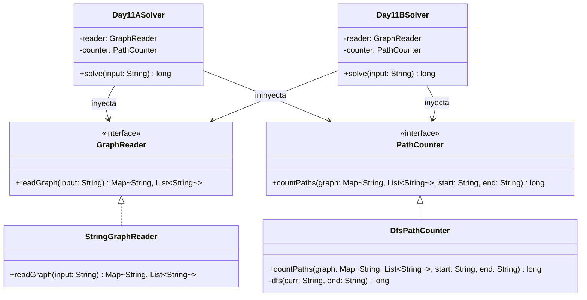

# Día 11: Reactor 

## Descripción del Problema

Bajo el suelo de la fábrica encontramos un reactor toroidal. Queremos establecer comunicación con él a través de una serie de dispositivos que reenvían datos en una sola dirección.
Se nos proporciona una lista de dispositivos y las conexiones a sus salidas correspondientes:
`bbb: ddd eee` significa que el dispositivo `bbb` tiene dos salidas dirigidas a `ddd` y `eee`.

Queremos encontrar el **número total de caminos distintos** que llevan a la salida principal del reactor.

*   **Parte A**: Calcular el número total de caminos distintos desde el dispositivo `you` hasta el dispositivo `out`.
*   **Parte B**: Calcular el número total de caminos desde el dispositivo `svr` (server rack) hasta el dispositivo `out` que visiten obligatoriamente tanto el dispositivo `dac` como el dispositivo `fft` (en cualquier orden).

---

## Modelo de Dominio e Identificación de Tipos

1.  **`GraphReader` (Interfaz Adapter)**: Desacopla la lectura del origen de datos del modelo del dominio (grafo).
2.  **`StringGraphReader` (Clase)**: Implementación concreta que procesa las líneas CSV/texto y construye el grafo de adyacencias `Map<String, List<String>>`.
3.  **`PathCounter` (Interfaz Strategy)**: Estrategia de negocio para calcular el número de caminos en el grafo.
4.  **`DfsPathCounter` (Clase)**: Implementación mediante Búsqueda en Profundidad (DFS) y Memoización. Para evitar ciclos infinitos en caso de que existan loops de retorno, utiliza un conjunto de nodos activos `visiting`.
5.  **`Day11ASolver` (Orquestador Parte A)**: Inyecta el lector y el buscador de caminos desde `you` hasta `out`.
6.  **`Day11BSolver` (Orquestador Parte B)**: Inyecta el lector y calcula los caminos desde `svr` hasta `out` pasando por `fft` y `dac` mediante multiplicación combinatoria sobre el orden topológico.

---

## Arquitectura del Día

---

## Patrones de Diseño Aplicados

*   **Strategy Pattern (Conteo de Caminos)**: Abstrae la lógica de negocio para encontrar caminos mediante la interfaz `PathCounter`. Reutilizamos la misma estrategia `DfsPathCounter` tanto para la Parte A como para las múltiples llamadas de la Parte B.
*   **Adapter Pattern (Reader)**: Desacopla el origen físico del grafo mediante la interfaz `GraphReader`.

---

## Principios de Diseño Aplicados

Durante la implementación de este día se han respetado rigurosamente los siguientes principios de diseño:

*   **Principio de Inversión de Dependencias (DIP)**: Los orquestadores `Day11ASolver` y `Day11BSolver` interactúan con la topología sin acoplarse con una clase algorítmica específica. Su dependencia estricta hacia las abstracciones `GraphReader` y `PathCounter` permite inyectar distintas variantes lógicas (BFS, A*, DFS) limpiamente.
*   **Principio Abierto/Cerrado (OCP)**: Gracias al patrón Strategy (`PathCounter`), el sistema de cálculo de rutas está preparado para crecer. Si el grafo cambia en el futuro de no ponderado a ponderado (y requiriese Dijkstra, por ejemplo), bastaría con proveer una nueva estrategia sin alterar la base de los orquestadores.
*   **Principio DRY (Don't Repeat Yourself)**: El complejo cálculo del recorrido en profundidad con memoización reside de forma unívoca en `DfsPathCounter`, siendo reusado de manera transparente y eficiente tanto por la consulta simple de la Parte A como por la pesada algoritmia secuencial de 6 consultas de la Parte B.

---
