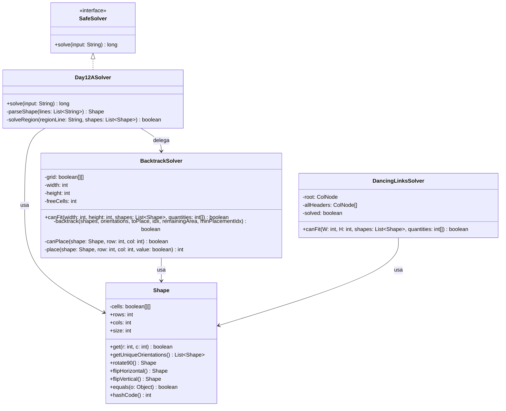

# Día 12: Christmas Tree Farm 

## Descripción del Problema

Los elfos están preocupados por si los regalos con formas geométricas complejas caben en las cuadrículas rectangulares bajo los árboles. Se nos proporciona:
1. Una lista de formas estándar de regalos dadas sobre una rejilla con `#` (ocupado) y `.` (vacío).
2. Una lista de regiones rectangulares $W \times H$ y el recuento de cuántos regalos de cada tipo deben colocarse en dicha región de manera exacta y sin solaparse.

Los regalos se pueden rotar (90, 180, 270 grados) y reflejar (horizontal o verticalmente) libremente en la rejilla.

El objetivo es determinar **cuántas de estas regiones pueden acomodar todos los regalos indicados de forma exacta**.

---

## Modelo de Dominio e Identificación de Tipos

1. **`Shape` (Clase de Dominio)**: Representa el molde geométrico de un regalo. Encapsula las dimensiones del regalo, el cálculo de su área efectiva y la generación de todas sus orientaciones únicas (rotaciones y reflexiones) utilizando colecciones de Java basadas en `equals` y `hashCode` (con `Arrays.deepEquals`).
2. **`BacktrackSolver` (Estrategia Principal)**: Servicio de dominio que determina si un conjunto de moldes cabe en una región mediante **backtracking exacto** con podas de área, orden por tamaño y ruptura de simetría para instancias idénticas.
3. **`DancingLinksSolver` (Estrategia Alternativa)**: Implementación secundaria incluida en el proyecto basada en el algoritmo DLX (Algorithm X) de Donald Knuth para Exact Cover, ofreciendo un paradigma de resolución matemático alternativo al backtracking estándar.
4. **`Day12ASolver` (Orquestador — Adapter)**: Lee el input en texto plano, parsea los moldes y las regiones, y delega la verificación de empaquetado a la estrategia inyectada. Actúa como adaptador entre el formato de entrada y el modelo de dominio.

---

## Arquitectura del Día

---

## Patrones de Diseño Aplicados

*   **Adapter Pattern (Parseo de entrada)**: `Day12ASolver` actúa como adaptador entre el formato textual del input (moldes en ASCII + líneas de región) y el modelo de dominio (`Shape`, arrays de cantidades). Aísla completamente el parseo del algoritmo de empaquetado, de forma análoga a los `Reader` de días anteriores.
*   **Strategy Pattern (Algoritmo de Empaquetado)**: `BacktrackSolver` encapsula la estrategia de resolución (backtracking exacto). Al estar desacoplado de `Day12ASolver`, podría sustituirse por otra implementación (p.ej. Dancing Links, ILP) sin modificar el orquestador.
*   **Domain Model**: La clase `Shape` agrupa estado y comportamiento relacionados con la geometría de un molde (área, orientaciones, rotaciones, reflexiones), evitando lógica dispersa por el código.

---

## Principios de Diseño Aplicados

Durante la implementación de este día se han respetado rigurosamente los siguientes principios de diseño:

*   **Principio de Inversión de Dependencias (DIP)**: El adaptador `Day12ASolver` interactúa con el sistema de ensamblaje empleando inyección de dependencias hacia implementaciones que respetan una semántica pura de caja negra (p.ej., delegando todo el cálculo del encaje del puzle 2D a la capa Solver).
*   **Principio Abierto/Cerrado (OCP)**: La encapsulación algorítmica permite que se pueda sustituir el motor actual de backtracking por alternativas como ILP (Integer Linear Programming) o el legendario algoritmo DLX (`DancingLinksSolver`, ya incluido modularmente en el proyecto), sin alterar en absoluto el flujo de control del orquestador.
*   **Principio de Responsabilidad Única (SRP)**: Destaca la aplicación del patrón *Rich Domain Model* sobre la clase `Shape`. Esta clase asume de forma centralizada la responsabilidad de toda la lógica espacial (orientaciones, rotaciones, volcado), mientras que la exhaustiva mecánica combinatoria del árbol queda confinada exclusivamente a las clases Solver especializadas.

---
